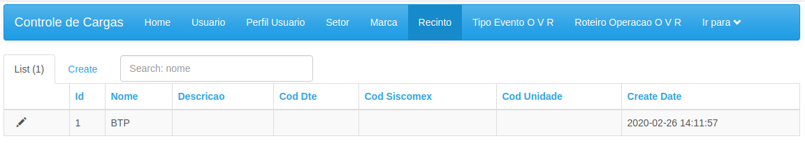

### Interface de administração

####Acesso
Pelo menu "Administração", dentro da lista "Pesquisas" no menu da tela inicial, 
é possível administrar algumas tabelas do Sistema.

#### Tela inicial
Então, caso o Usuário possua o perfil de "Supervisor" e/ou de "Cadastrador" 
terá acesso à seguinte tela:

Nesta tela é possível gerenciar várias tabelas de Sistema, entre elas a lista de 
marcas cadastradas, o cadastro de Recintos, Setores, Usuários, Perfis de Acesso, 
opções de Tipos de Evento a informar no Sistema e os roteiros/check-lists.

É possível listar, pesquisar, filtrar (por exemplo, visualizar Usuários de um Setor), 
editar, incluir e em alguns casos incluir

#### Cadastro de Marcas

Lista de marcas

Busca pelo nome

Edição

#### Cadastro de Setores

Os Setores podem ser cadastrados em formato de "árvore". Por exemplo, pode ser cadastrado um
Setor DIREP e duas equipes EQREP1 e EQREP2. Usuários cadastrados no Setor DIREP poderá ver Fichas
do Setor DIREP e dos dois Setores Filhos. Já os Usuários cadastrados nos Setores Filhos verão apenas
Fichas de suas Equipes.

Várias telas são influenciadas pela propriedade de árvore do Setor. Para exemplo, olhar a parte de
Roteiros deste manual.

É possível pesquisar por nome.

#### Cadastro de Tipos de Evento

Normalmente não será necessária a manutenção desta tabela, mas há a opção. Deve se tomar 
cuidado especial com os Eventos com campo "TipoEventoEspecial", pois estes Eventos são utilizados
dentro do código para diferenciar os seguintes código de Evento Especial, e a aplicação faz as atualizações
necessárias com base neste cadastro.

EventoEspecial
- Responsavel = 1
- RVF = 2
- TG = 3
- Autuação = 4

É possível pesquisar por nome e filtrar for fase.

#### Cadastro de Recintos

O campo cod_dte é necessário para integração automática das FMAs do Porto de Santos. 
Esta tabela deve ser importada automaticamente do SISCOMEX quando possível e também não precisa
de manutenção regular. 

É possível pesquisar por nome.

 
