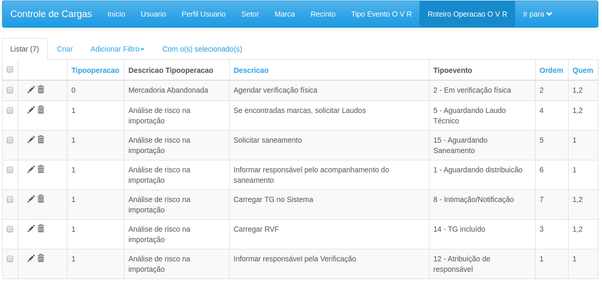
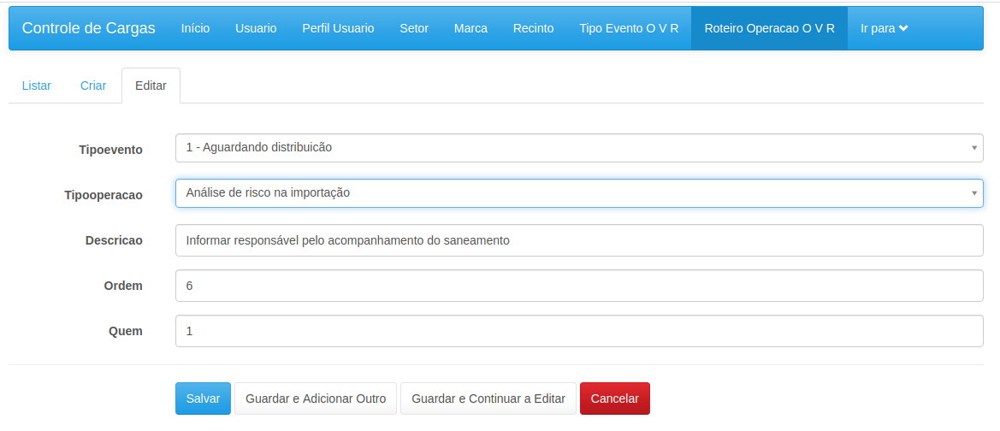

### Check-listas - roteiros

É possível cadastrar, por tipo de Operação, uma lista de Tipos de Evento esperado
e a sua descrição. Assim, funciona como um check-list para evitar que sejam esquecidas
etapas, como desbloquear a carga, atualizar informações no Radar e outros sistemas,
intimar contribuinte, etc.

O Check-list pode ser cadastrado aqui nesta interface e depois consultado dentro de cada
Ficha. O Sistema verificará a existência do TipodeEvento na Ficha e já "riscará" o Check-list
automaticamente.

