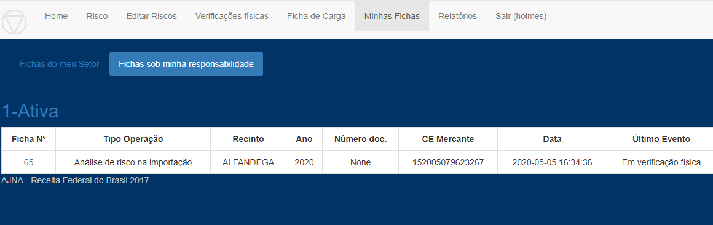
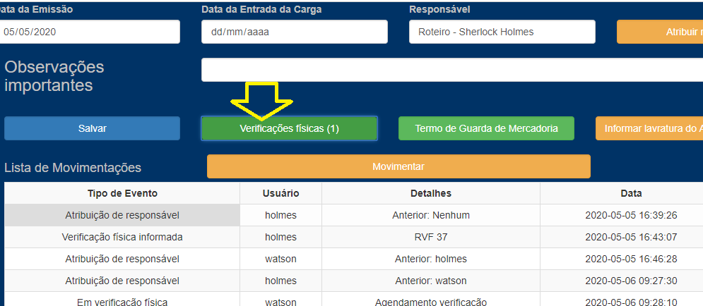
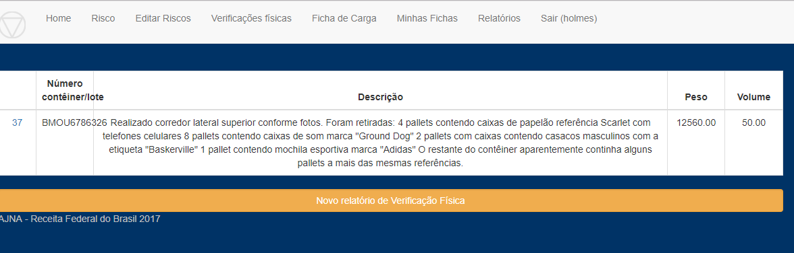
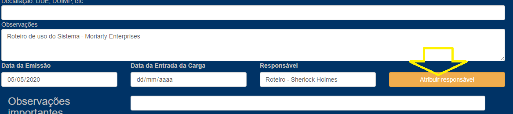
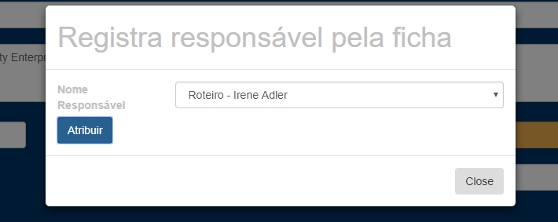
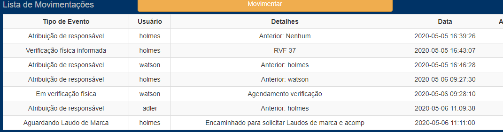

Holmes consulta suas fichas, vê mudanças na verificação 
e que possivelmente há uma contrafação, distribui 
para Irene Adler para tratar.

Ver verificações

Distribuir e informar para pedir Laudo

