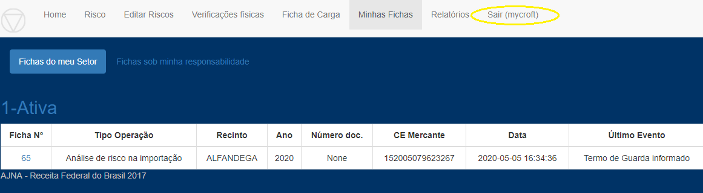
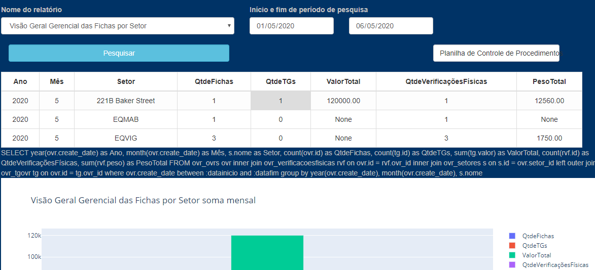
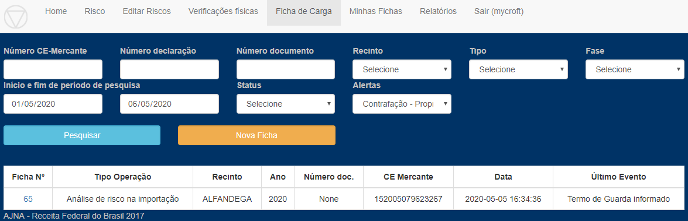

Mycroft entra no Sistema 

1 - Acompanha fichas do Setor

Mycroft precisa informar gerenciais/produtividade

2 - Roda relatórios

Mycroft precisa pesquisar cargas perecíveis (ou outra pesquisa)

3 - Roda pesquisa Ficha

