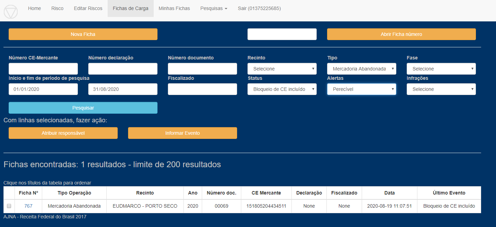
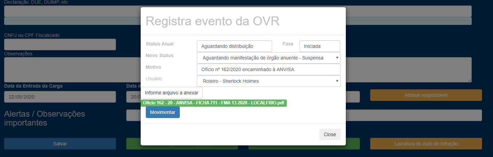
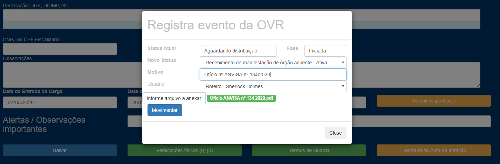

Solicitando e recebendo a manifestação de órgão anuente:

1 – Consulta fichas do tipo “Mercadoria Abandonada” com status “Bloqueio de CE incluído” e alerta “Perecível”:

2 – Informa evento “Aguardando manifestação de órgão anuente” e anexa o ofício elaborado, já com assinatura digital do representante da Unidade:

3 – Ao receber o ofício de resposta do órgão anuente, informa evento “Recebimento de manifestação de órgão anuente”:
