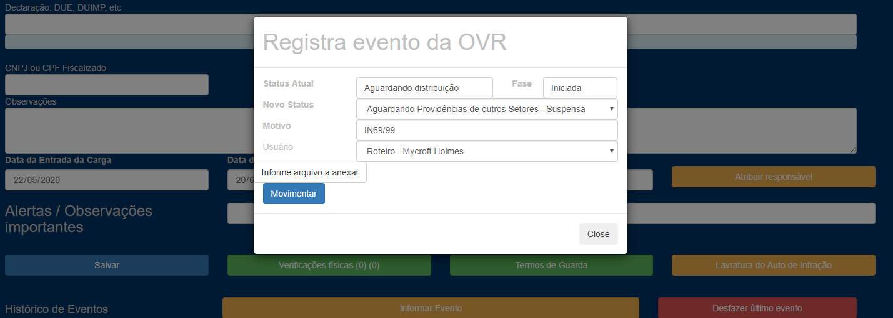
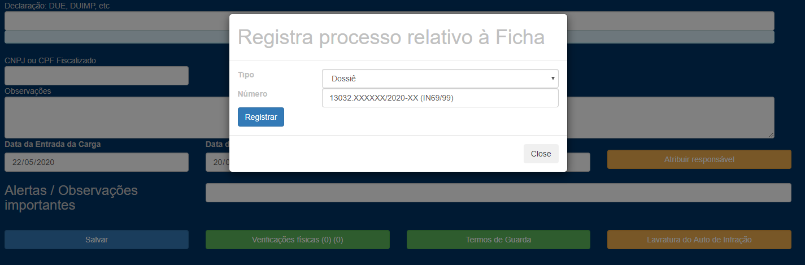
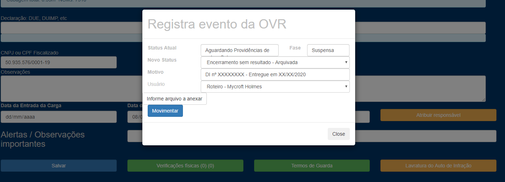

Recebimento de pedido de retomada de despacho:

1 – Recebido o pedido de retomada de despacho e julgado procedente, informar evento “Aguardando providências de outros setores”:

2 – Em “informar processo”, indicar nº do “dossiê” da petição:

3 – Posteriormente, se a mercadoria foi retirada por meio do registro de DI, informar evento “Encerramento sem resultado”:
