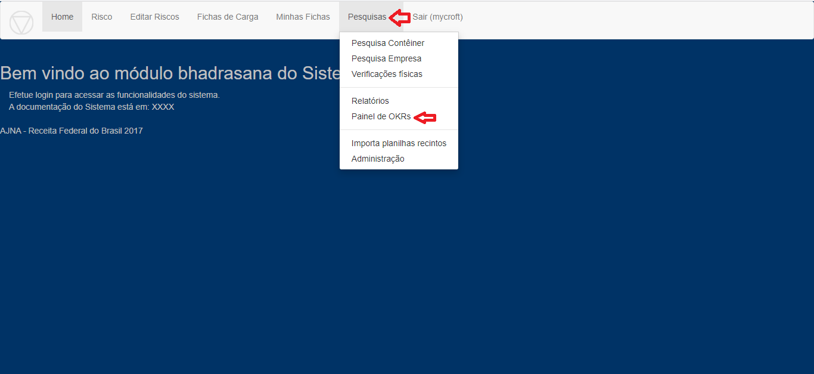
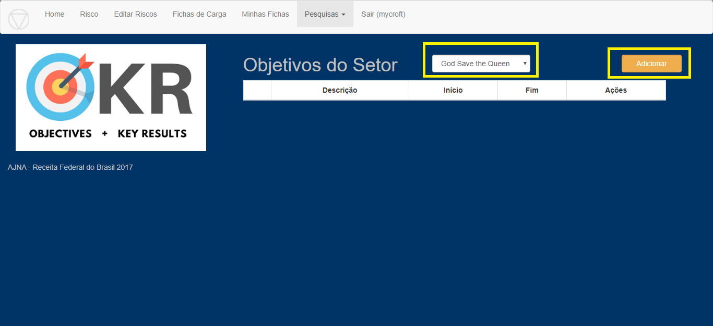
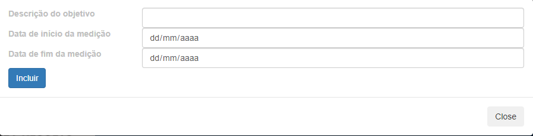
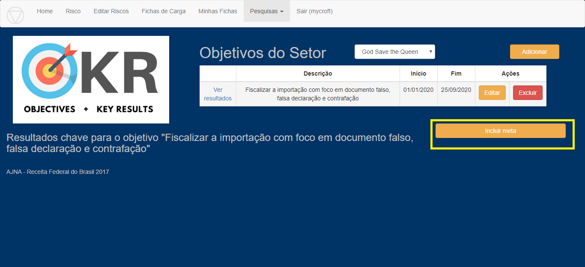
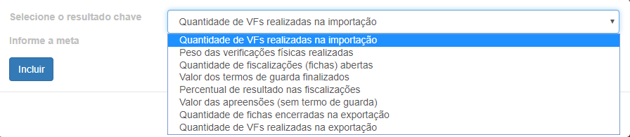

* Painel de OKRs - Como configurar

1 - Na tela do sistema, clicar em “Pesquisas” e em seguida em “Painel de OKRs”

2 - Na tela seguinte, escolher o setor e clicar em “Adicionar” para 
adicionar nova métrica.

3 - Irá abrir uma caixa para preencher a “Descrição do objetivo” e 
para definir as datas de início e fim da medição que se deseja analisar. 

Para finalizar, clicar em “Incluir”.

4 - Em seguida, clique em “Incluir meta” para incluir um novo indicador 
de acompanhamento dos resultados.

5 - Escolher um “Resultado chave”, ou seja, uma métrica que se deseja 
acompanhar e que vai ser comparado com uma meta específica a ser informada. 
Para finalizar, clique em “Incluir”.

