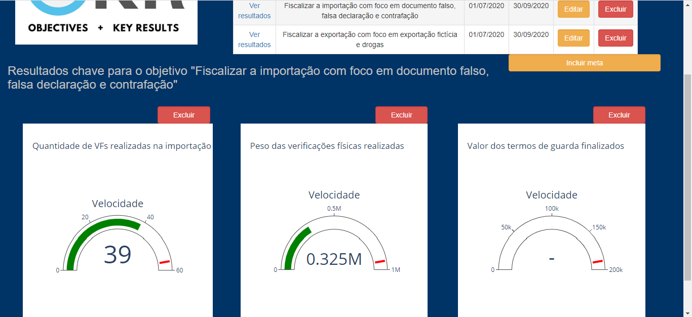

1 - No Setor Direp, para o objetivo “Fiscalizar a importação com foco em 
documento falso, falsa declaração e contrafação”, foram incluídos os 
resultados: 

- “Quantidade de VFs realizadas na importação”, 

- “Peso das verificações físicas realizadas”,

- “Valor dos termos de guarda finalizados”.

Além disso, para cada resultado foi definida a meta esperada, marca 
vermelha nos gráficos abaixo.

Dessa forma é possível acompanhar, para cada objetivo, se os resultados 
estão próximos da meta e qual a velocidade com que se atinge a meta. 

2 - No setor Direp, para o objetivo “Fiscalizar a exportação com foco 
em exportação fictícia e drogas”,  foram incluídos os resultados:

- “Valor das Apreensões (sem termo de guarda)”,

- “Quantidade de fichas encerradas na exportação”,

- “Quantidade de VFs realizadas na exportação”

