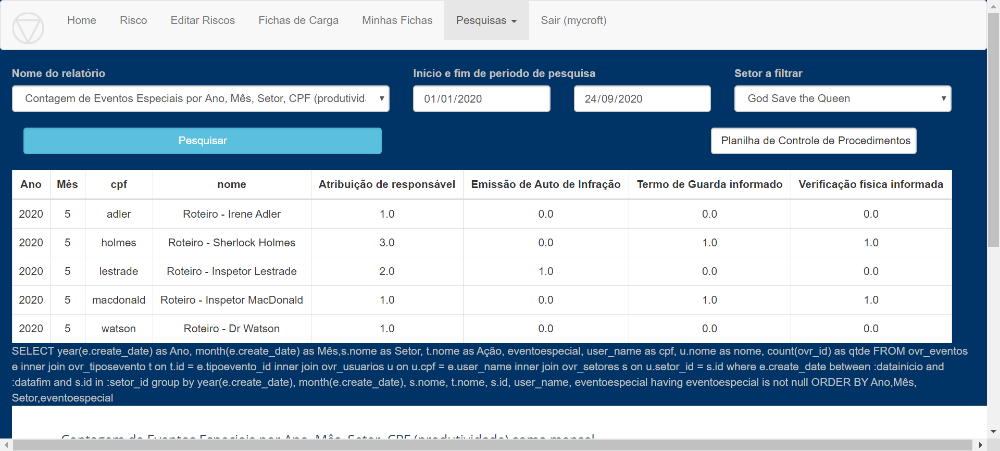

Ao selecionar esse relatório, é possível acessar a produtividade de 
todos os membros da Equipe. 

No exemplo do Mycroft ele analisa dados de toda a divisão “God Save 
the Queen”. 

Dessa forma, pode-se avaliar/mensurar:

1 - quantidade de “Atribuição de responsável” que cada membro recebeu,

2 - quantidade de “Emissão de Auto de Infração” que cada membro gerou,

3 - quantidade de “Termo de Guarda Informado” que cada membro gerou,

4 - quantidade de “Verificação física informada” por membro.

