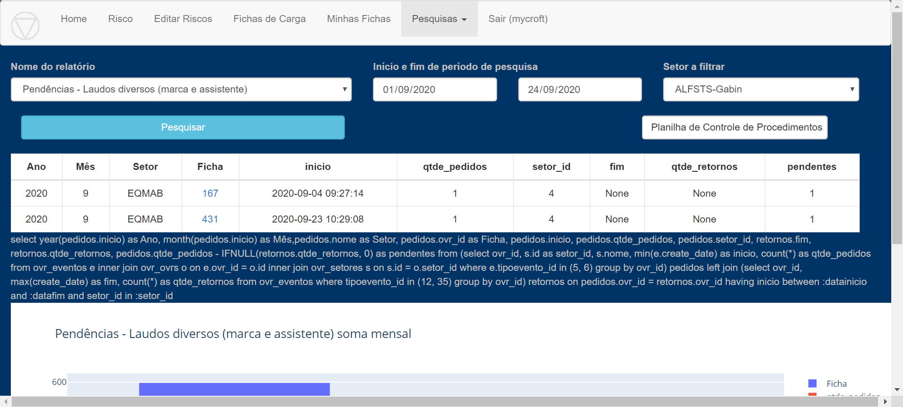

Ao selecionar esse relatório, pode-se mensurar a quantidade de Laudos 
sem retorno de cada Setor por ficha. 

A coluna “pendentes” compara a quantidade de pedidos de laudo com a 
quantidade de retornos recebidos para cada ficha.

