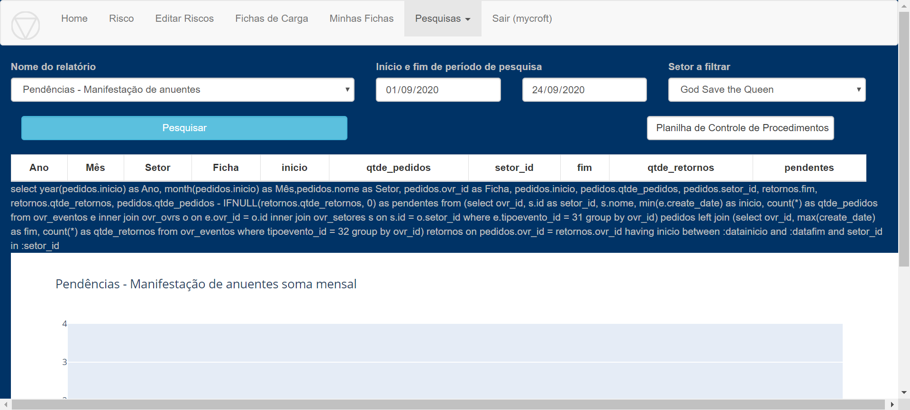

Ao selecionar esse relatório, é possível mensurar a quantidade de Pedidos 
de Manifestação sem retorno de cada Setor por ficha. 

A coluna “pendentes” compara a quantidade de pedidos de manifestação 
com a quantidade de retornos recebidos para cada ficha.

