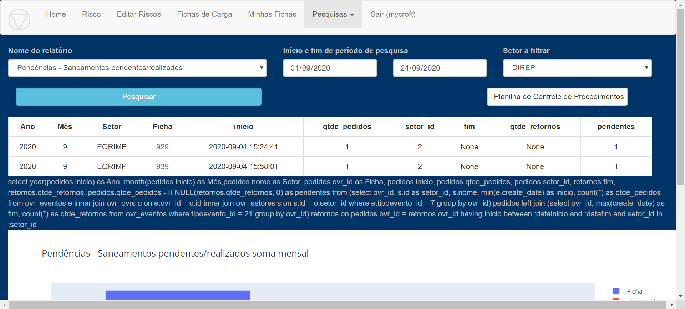

Ao selecionar esse relatório, pode-se mensurar a quantidade de Pedidos 
de Saneamento sem retorno de cada Setor por ficha. 

A coluna “pendentes” compara a quantidade de pedidos de saneamento 
que estão aguardando retorno com a quantidade de retornos recebidos 
para cada ficha.

