Mac Donald entra no Sistema

1 - Consulta suas fichas

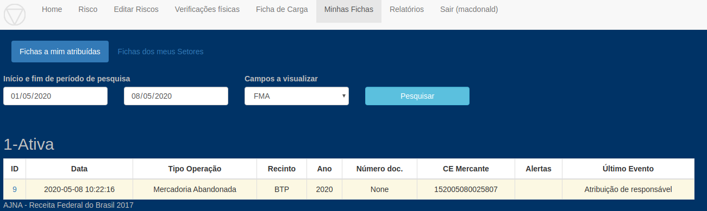

2 - Agenda verificação física

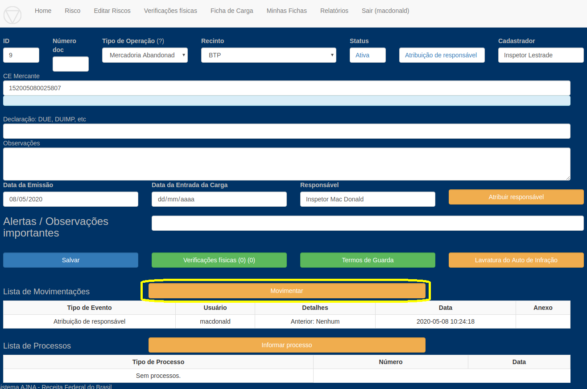

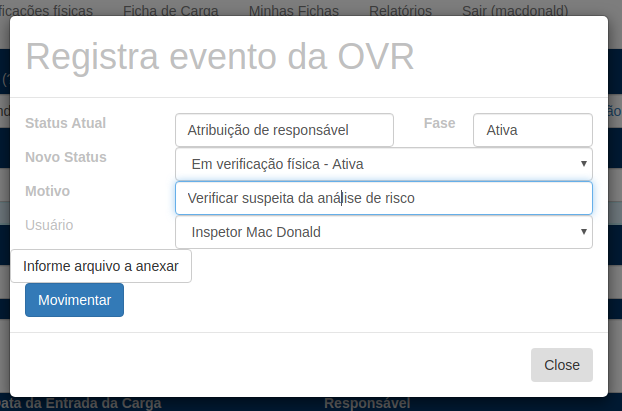

3 - Informar RVF carregando fotos

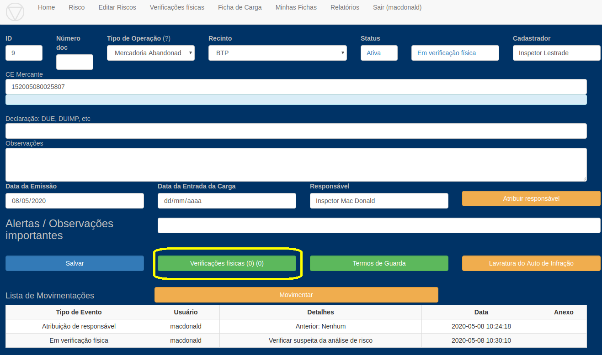

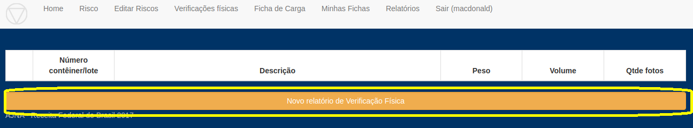

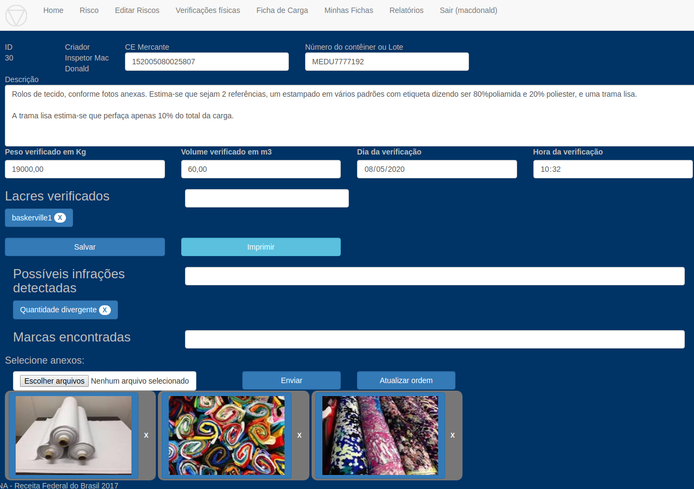

4 - Ordena saneamento

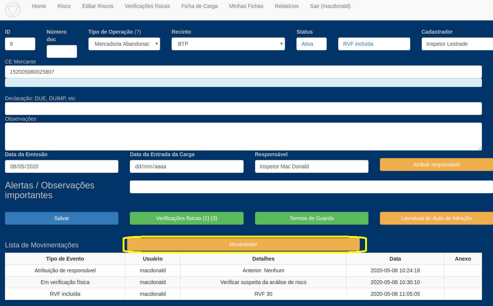

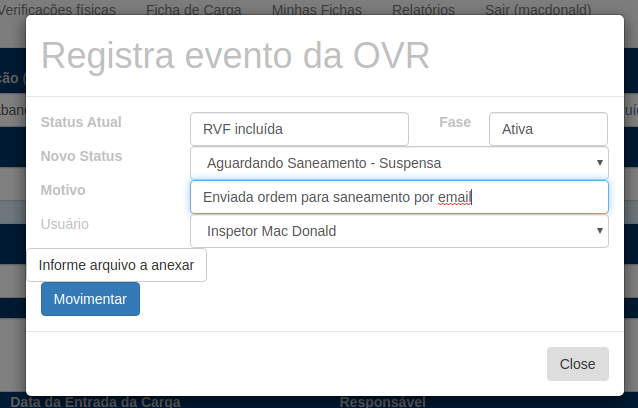

5 - Informa intimação

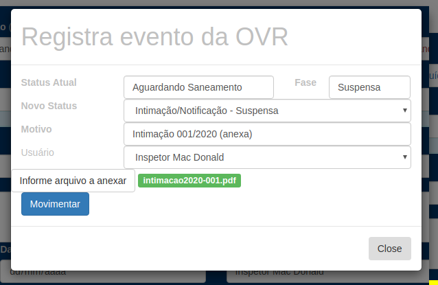

6 - Recebe saneamento e informa

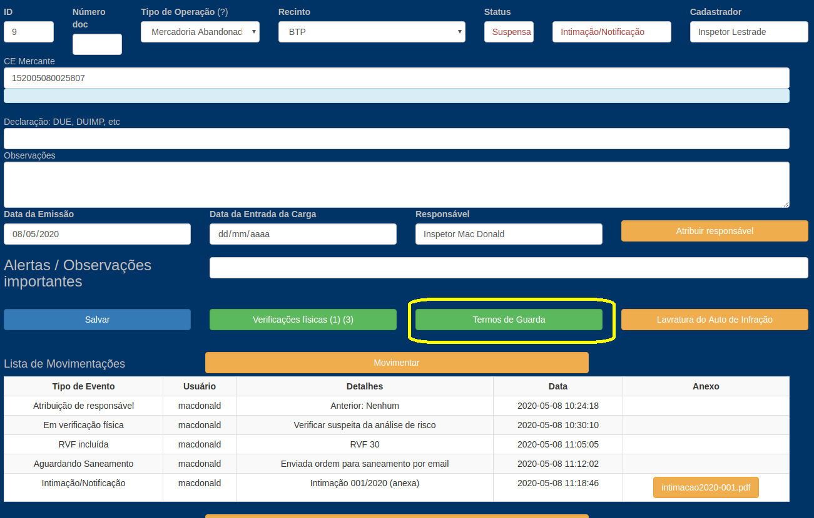

7 - Devolve para Lestrade

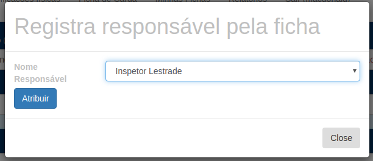

