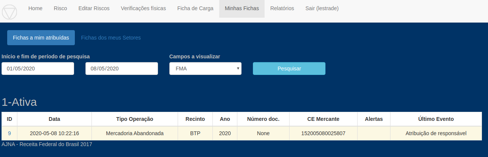
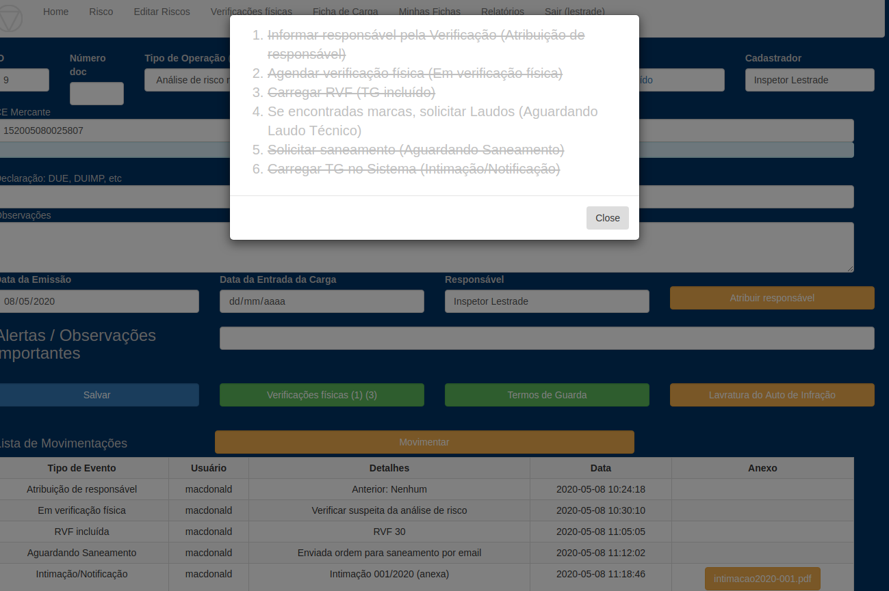
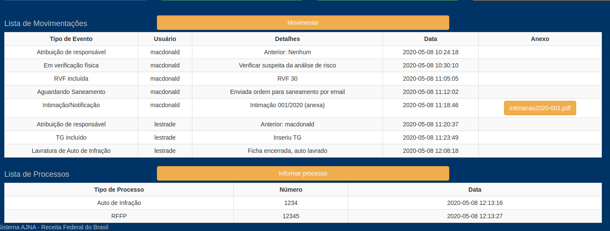

Lestrade recebe de volta a ficha

1 - Consulta suas fichas

2 - Consulta check-list

Clicar no ? ao lado do Tipo de Operação, no alto da tela.

3 - Faz Auto de Infração, RFFP, arquivos CTMA/Secta, atualiza bloqueio do CARGA, etc,
 e informa Eventos e Processos

O Auto de Infração é informado no botão "Lavratura de Auto"

Registrar a geração de arquivos CTMA com o Evento específico do botão "Movimentar" 

Os números dos processos do Auto e da RFFP podem ser informados no botão "Informar Processo" 

