**Usuário Sherlock Holmes**, da Equipe 221B Baker Street, seleciona o 
CE-Mercante 152005079623267 para verificação:

1 - Criar ficha para CE 152005079623267
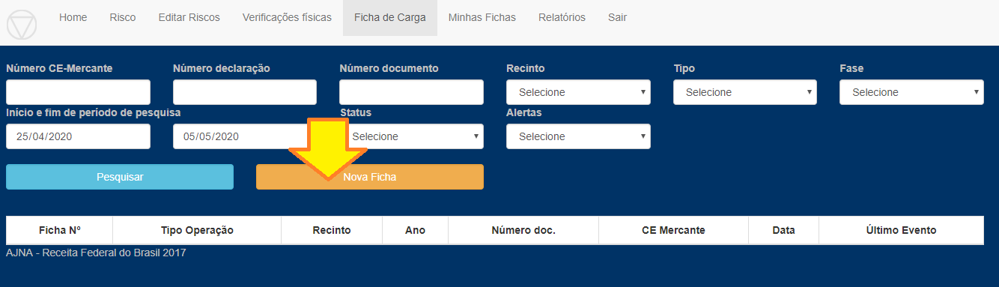

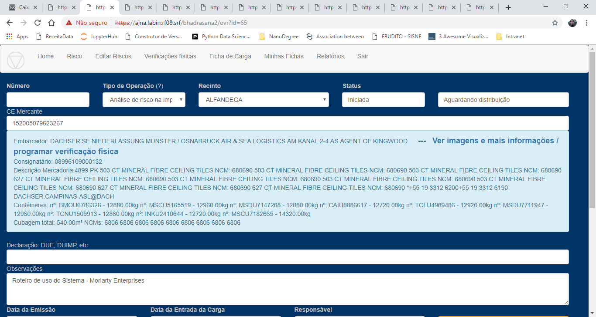

2 - Atribuir responsabilidade para Watson
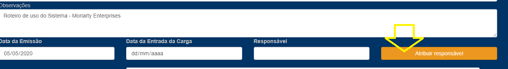

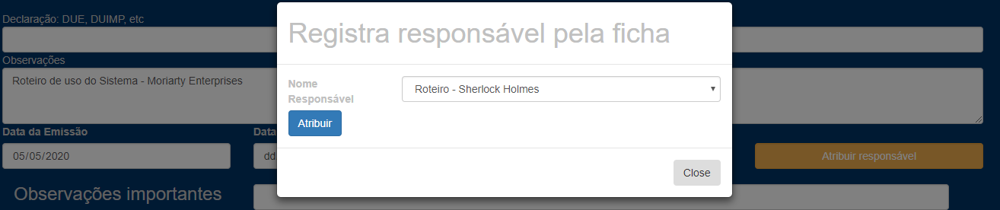

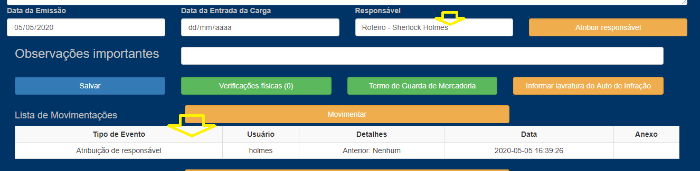

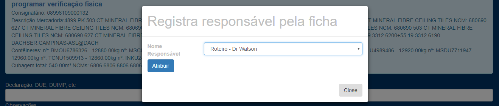

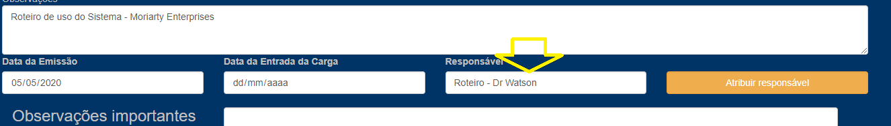

3 - Entrar na programação/lista de contêineres e imagens e programar verificação física de um dos contêineres
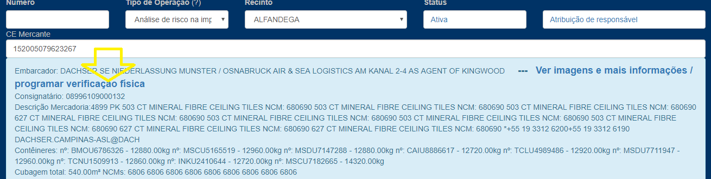

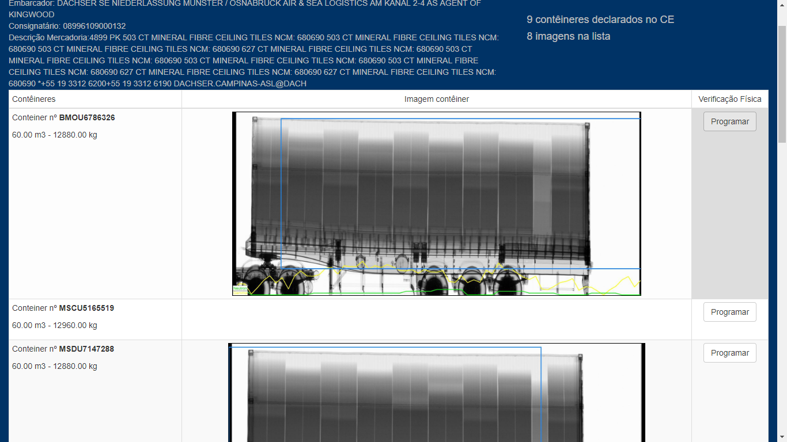

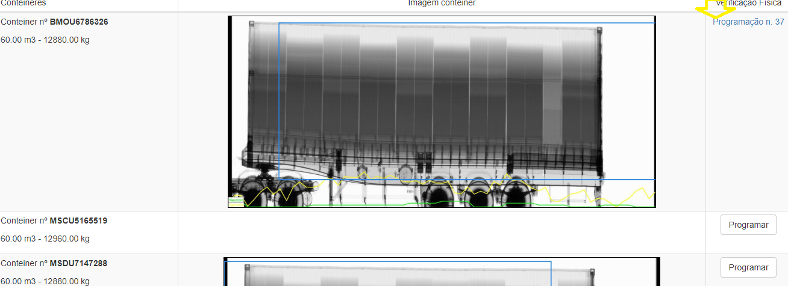

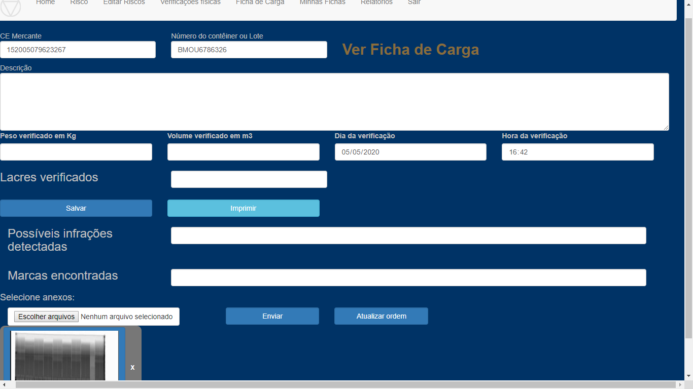

Por último, para Sherlock, assim aparecerão as telas "Fichas do meu Setor" e "Fichas sob minha responsabilidade":
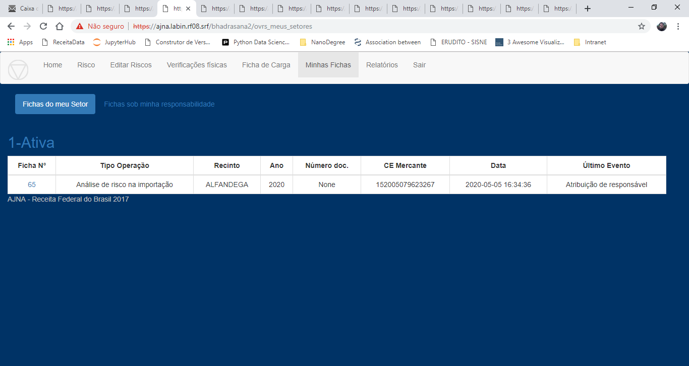

