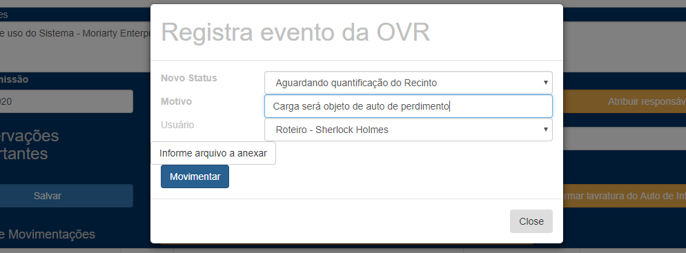
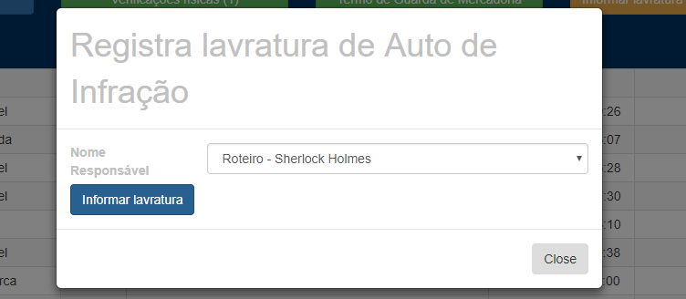

Holmes recebe de volta a ficha

1 - Consulta suas fichas

2 - Ordena saneamento

3 - Recebe saneamento e informa

4 - Faz Auto de Infração e informa

5 - Informa RFFP

6 - Consulta check-lista para saber se falta algo

7 - Gera arquivos CTMA e informa Evento

8 - Atualiza bloqueio do CARGA e informa Evento
