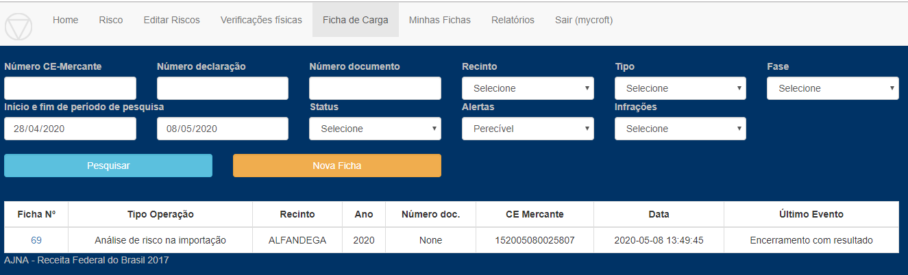

Mycroft entra no Sistema para acompanhar 

1 - Acompanha fichas do Setor 

Note-se que, como o Usuário mycroft está um uma divisão que possui duas equipes, fichas 
das duas equipes são exibidas. É possível optar por diversos conuntos de campos mudando 
a seleção "Campos a visualizar".

2 - Roda pesquisa Ficha

Além da visualização rápida de fichas de interesse em "Minhas Fichas", é possível fazer pesquisa por filtros
 personalizados. Abaixo, pesquisa por intervalo de datas de fichas com alerta de "Perecível".
 

