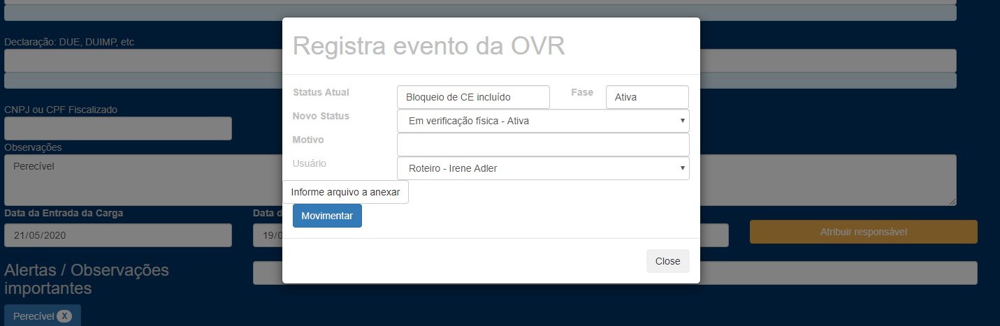
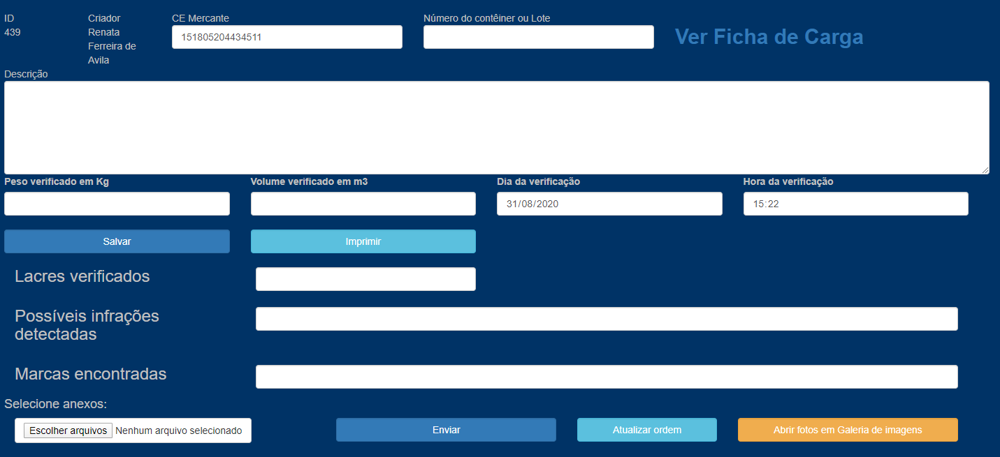
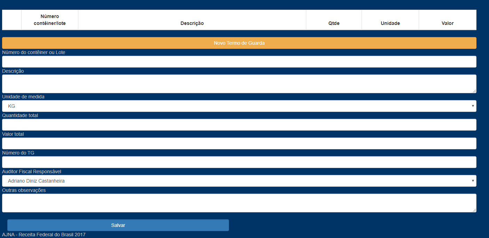
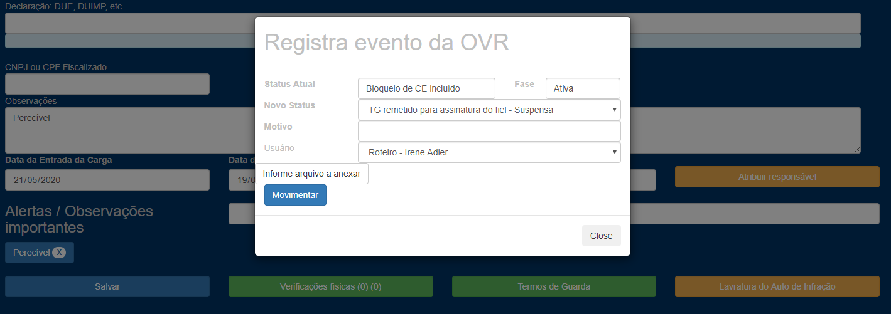
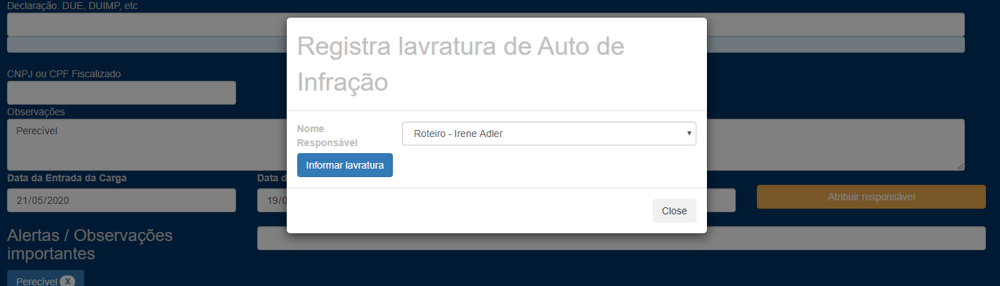
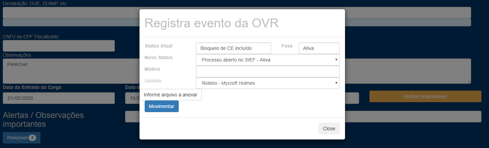
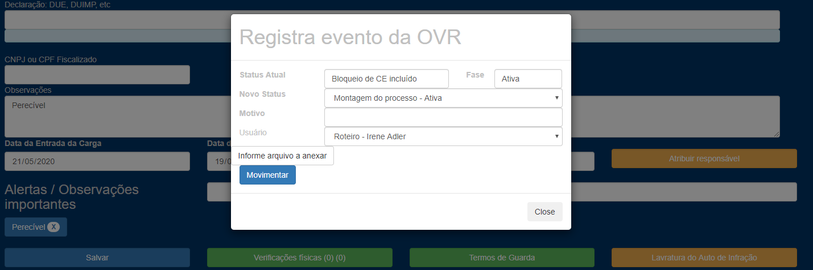
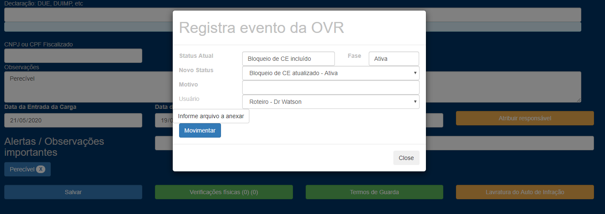
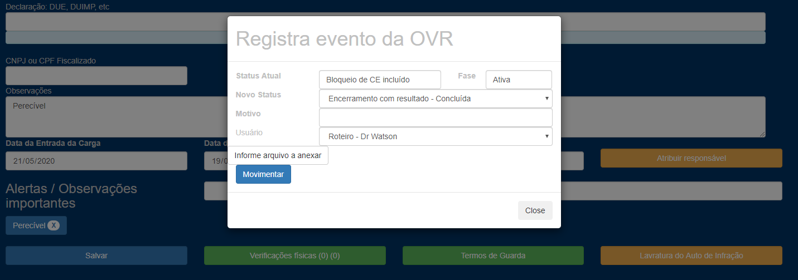

Verificação física, registro do Termo de Guarda e lavratura do Auto de Infração:

1 - Irene Adler consulta suas fichas em “Minhas fichas” - “Fichas a mim atribuídas”:

2 - Agenda verificação física e informa evento “Em verificação física”:

3 – Informa RVF em “Verificações físicas” e anexa fotos:

4 – Registra Termo de Guarda:

5 – Informa evento “TG foi remetido para assinatura do fiel”:

6 - Informa a Emissão do Auto de Infração:

7 – Distribui a ficha a Mycroft Holmes (AT ou apoio) para abertura do processo e demais providências.

8 - Mycroft Holmes (AT ou apoio) abre processo no SIEF e informa evento “Processo aberto no SIEF”. Em seguida, informa o nº do processo de perdimento em “Informar processo”:

9 - Holmes (AT ou apoio) redistribui a ficha à Irene Adler

10 - Irene Adler monta o processo e informa evento “Montagem de processo”:

11 - Watson (supervisor), ao receber o e-processo referente à ficha, faz a alteração do bloqueio no Siscomex-Carga e encerra a ficha:

