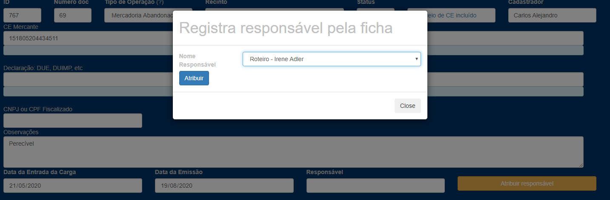
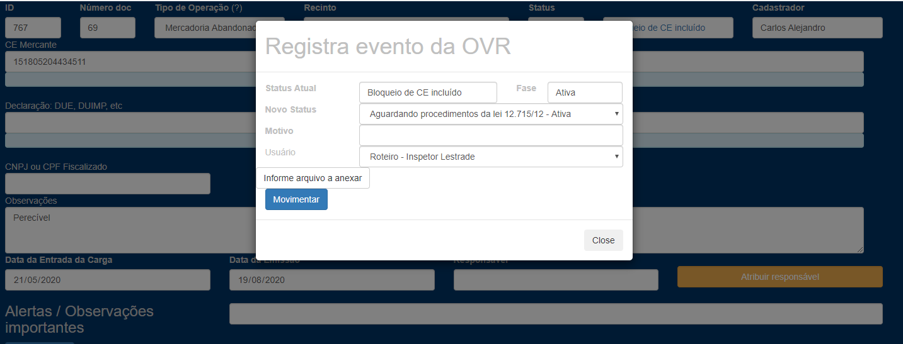
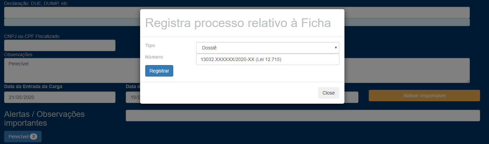

Direcionando a ficha após resposta do órgão anuente:

1 – Se o órgão anuente libera a comercialização da mercadoria, distribuir a ficha ao responsável pela conferência física:

2 – Se o órgão anuente afirma que a mercadoria não está em condições de comercialização e consumo, a ficha é distribuída ao fiscal responsável pelos procedimentos da lei 12.715 e informa-se o evento “Aguardando procedimentos da lei 12.715/12:

Em seguida, informa o nº do dossiê aberto para tais procedimentos em “Informar processo”:
