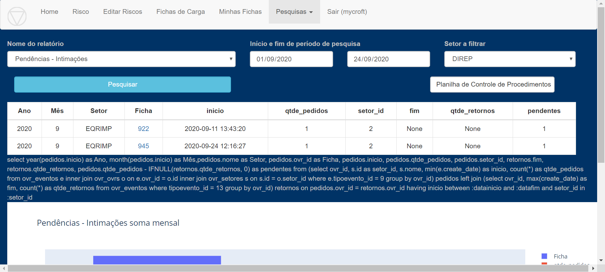

Ao selecionar esse relatório, é possível mensurar a quantidade de 
intimações sem retorno de cada Setor por ficha.
 
A coluna “pendentes” compara a quantidade de pedidos com a quantidade 
de retornos efetuados para cada Ficha.

