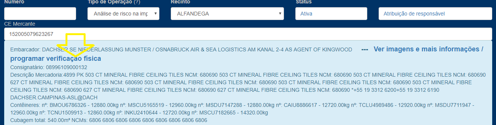

### Programação de verificação física

Ao cadastrar uma Ficha, agora é possível consultar a lista de contêineres,
 ver as imagens carregadas no AJNA e apenas com o toque de um botão escolher
  um contêiner para ser verificado.  

(Por enquanto disponível apenas para CE-Mercante. Falta implementar para DUE e 
também pretende-se exibir nesta tela dados de pesagem, logística, GateIn/Out, alertas,
etc)

#### Para usar: 

* Clique em "programar verificação física" 

* Clique em "Programar" na linha do contêiner desejado

* Pronto. É criada uma verificação física ainda vazia, mas já com CE,
 contêiner e a imagem do escâner anexada.

