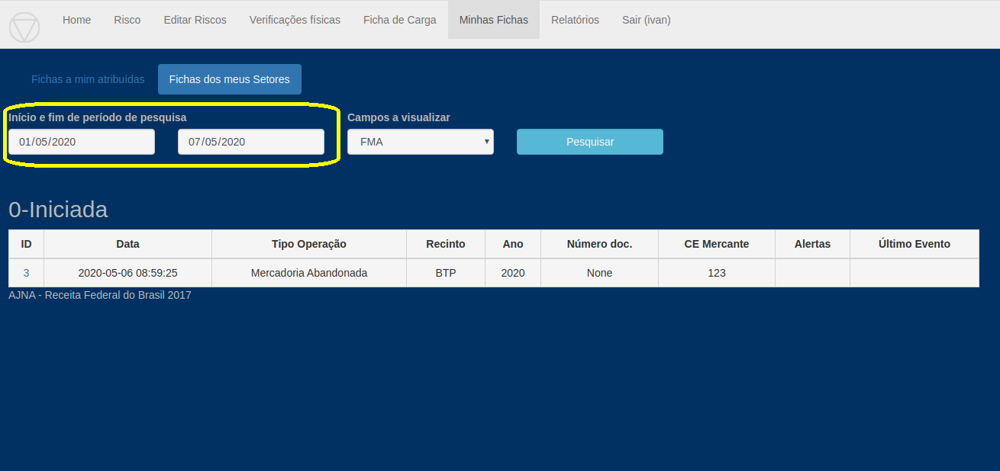
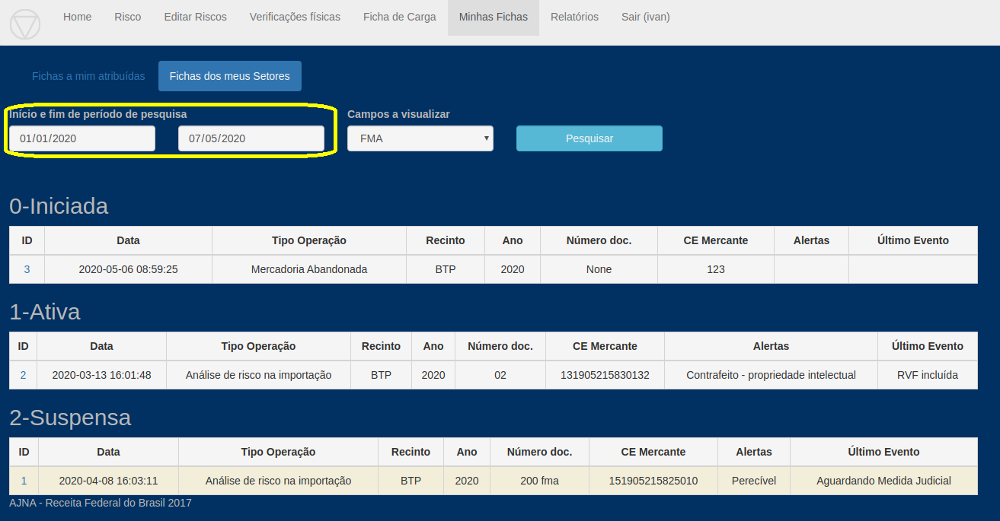

* Filtragem por data de criação da Ficha 

Apenas para "Fichas dos Meus Setores", fichas atribuídas, por *design*, **não** filtram data.

* Opções de visualização (escolher campos)

              - Criada tabela para gravar visualizações de OVRs: **todas** as visualizações de Fichas serão gravadas por usuário nesta tabela.

              - Função "Novas/não lidas" no "Minhas Fichas" Fichas que possuam Eventos com data maior que a última visualização pelo Usuário aparecerão com fundo amarelo destacado

