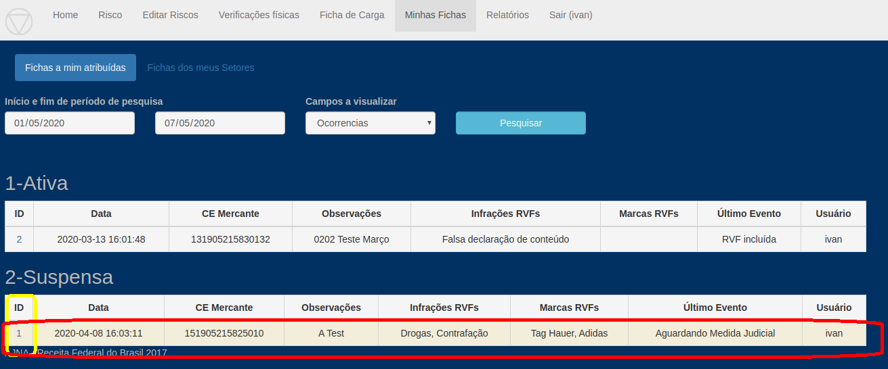
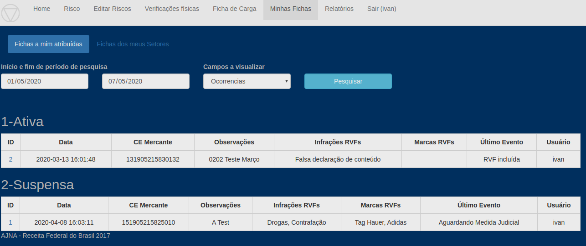

* Criada tabela para gravar visualizações de OVRs: **todas** as visualizações de fichas 
serão gravadas, por usuário, nesta tabela.

* Função "Novas/não lidas" no "Minhas Fichas"

Fichas que possuam eventos com data maior que a última visualização pelo Usuário aparecerão com fundo amarelo destacado:

Nesta tela a Ficha ID 1 ou não foi visualizada pelo usuário ativo ou tem Evento não visualizado. 

Ao clicar na ficha 1 e visualizar, ao voltar na tela não terão mais o destaque

