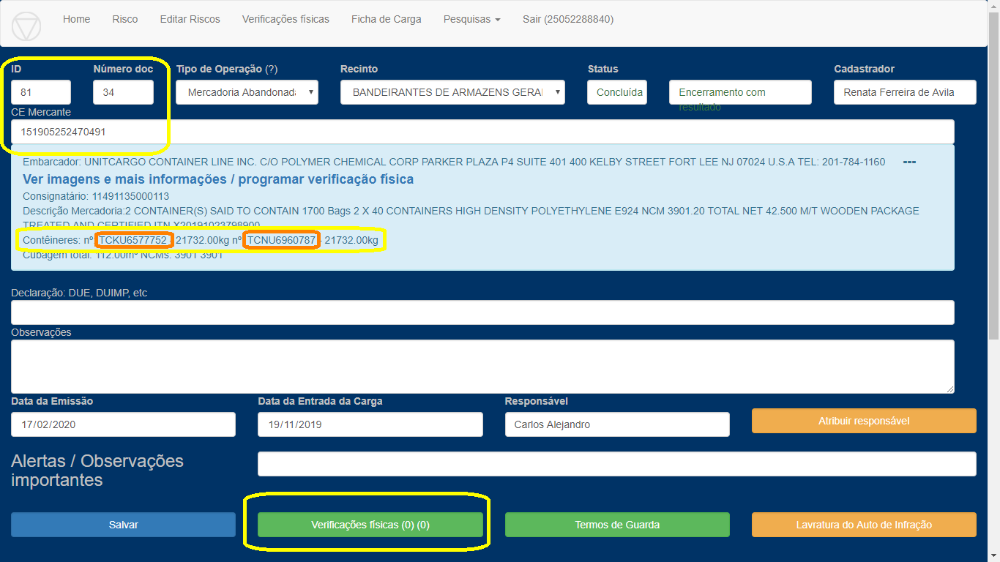
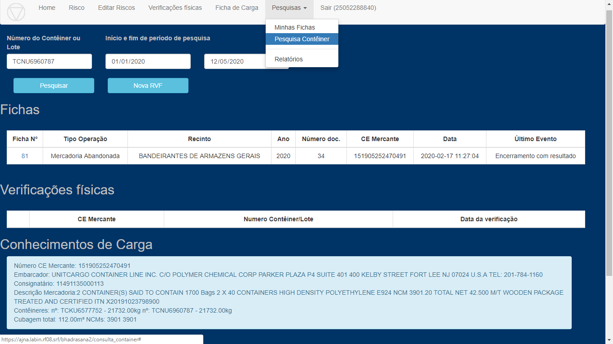
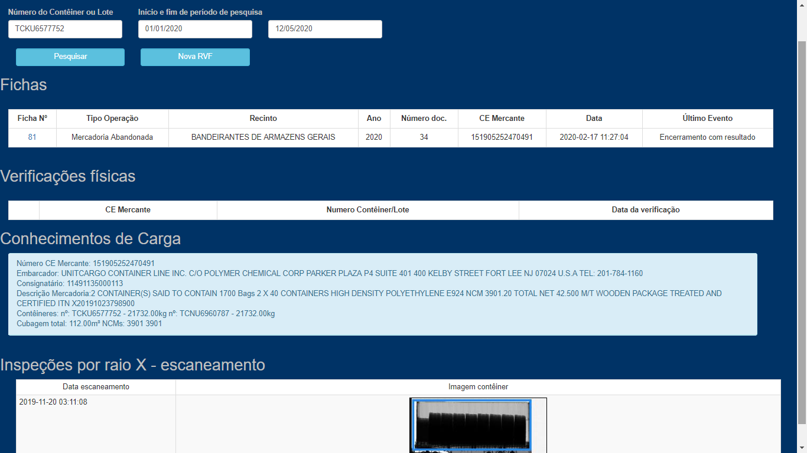

### Tela para pesquisa por número de contêiner em várias bases

Nesta tela, a partir do número de contêiner ou parte dele e intervalo de datas, o sistema vai listar:

    Fichas para CE-Mercante ou DUE que tenha o contêiner.
    Verificações físicas que tenham expressamente aquele contêiner.
    CEs em que o contêiner aparece.
    DUEs em que o contêiner aparece.
    Escaneamentos do contêiner.
    Outros ??? (Ex.: dados da API Recintos??)

###  Exemplo    

A Ficha 81 (FMA Bandeirantes 34/2020) não tem ainda verificações físicas 
com contêineres informados, apenas o CE mercante.

Mesmo assim, na tela de consulta de contêiner, pesquisando por qualquer um dos dois 
contêineres do CE, o sistema localiza esta Ficha (entre outras informações)

