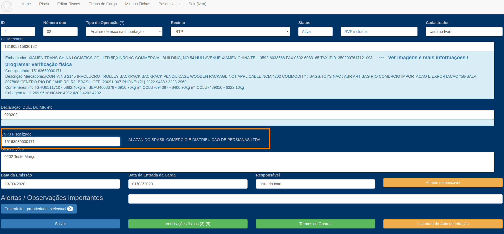
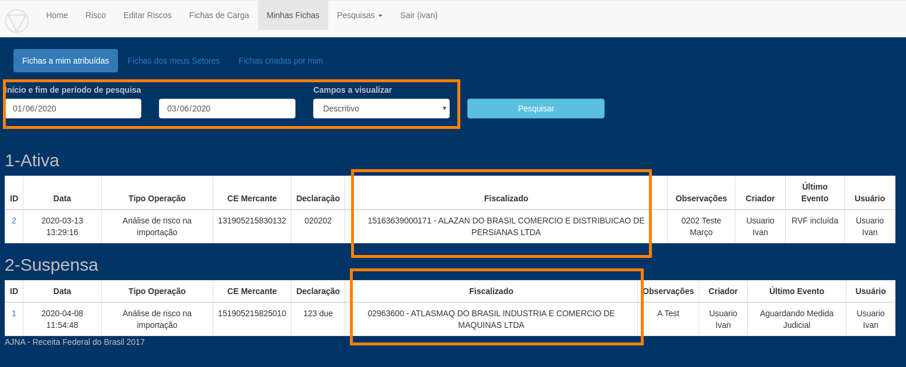
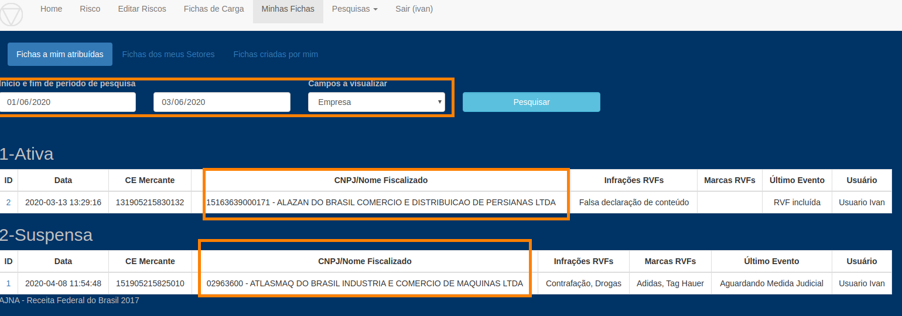
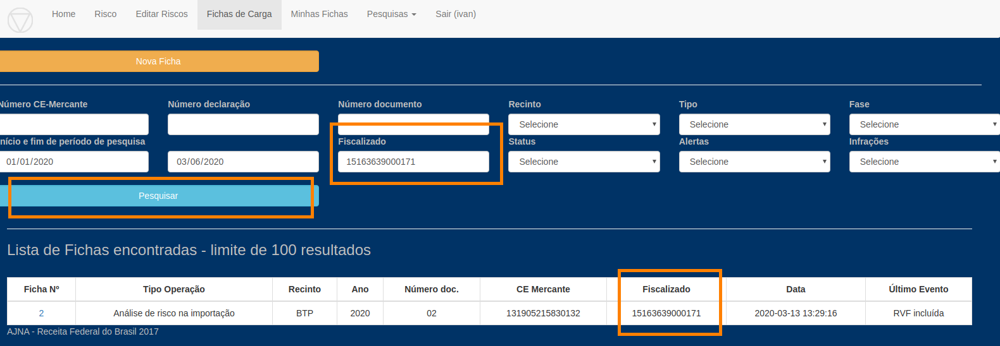
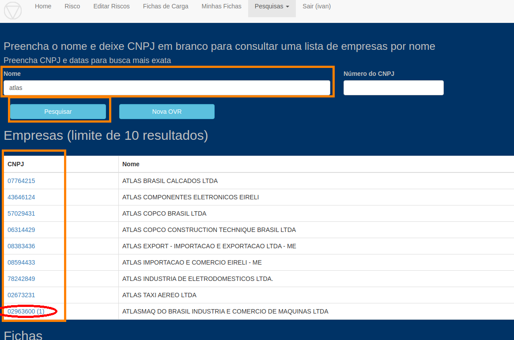
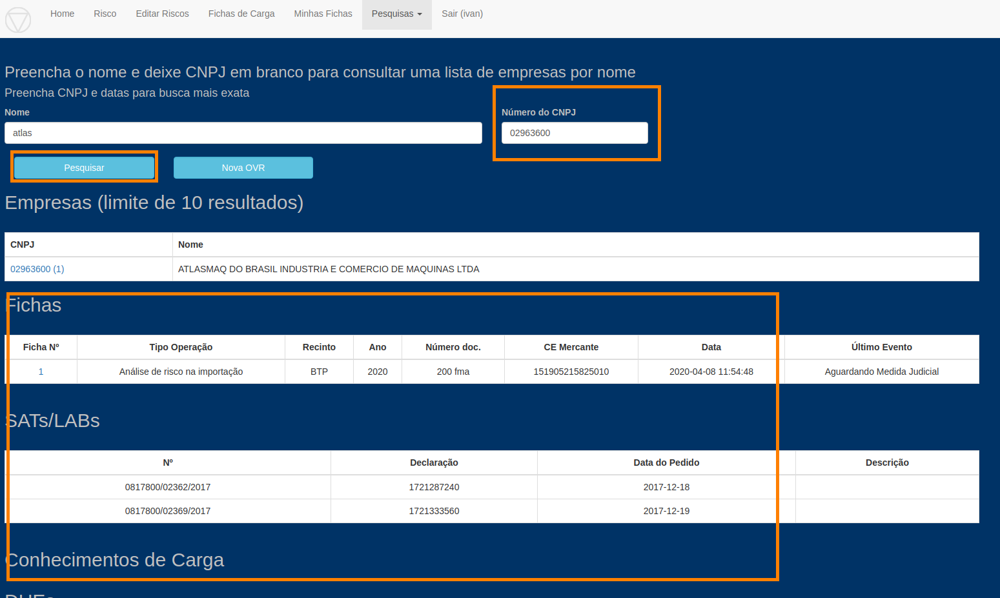

### Inclusão do campo "CNPJ Fiscalizado" na Ficha de Controle

* Incluído o campo "CNPJ fiscalizado" na Ficha

* Campo será preenchido automaticamente com consignatário do CE ou Exportador da DUE caso seja deixado em branco

* O nome da Empresa é automaticamente exibido na tela, ao lado do CNPJ, para conferência 

* O CNPJ e nome da Empresa passam a ser exibidos em algumas opções de visualização em Minhas OVRs

* O CNPJ e nome da Empresa passam a ser exibidos na pesquisa de Fichas, bem como a pesquisa por CNPJ

* O CNPJ fiscalizado passa a ser exibidos na listagem de fichas da Pesquisa Contêiner

* Nova tela: pesquisa de Empresa, integrada também ao Sistema Laudos (detalhes abaixo)

#### Novo campo CNPJ Fiscalizado

O campo pode ser preenchido com número do CNPJ. **Se deixado em branco será automaticamente preenchido a partir do CE ou DUE**   

#### Nova tela Minhas OVRs

#### Nova tela Pesquisa Ficha  

Preencha o campo "Fiscalizado" com o CNPJ para consultar. Atenção para as datas. 

#### Tela Pesquisa Empresa

Nesta tela, a partir do nome da empresa, CNPJ ou parte deles, o sistema vai listar:

    Empresas com aquele nome ou CNPJ parcial
    Fichas para CE-Mercante ou DUE que tenha a empresa
    SATs/LABs solicitados para a Empresa
    CEs em que a empresa é consignatária.
    DUEs em que a empresa é exportadora

A Empresa "AtlasMaq do Brasil" possui uma Ficha. Ao pesquisar por "Atlas" aparece uma lista de empresas cujo 
nome começam com esta palavra. Apenas ao lado do CNPJ da "AtlasMaq" é exibido um (1) indicando que esta possui uma ficha.

Clicando no CNPJ da Empresa, ou digitando no campo CNPJ acima e clicando em Pesquisar, serão exibidas Fichas, SATs,
CEs-Mercante e DUEs desta Empresa, caso existam na base.

