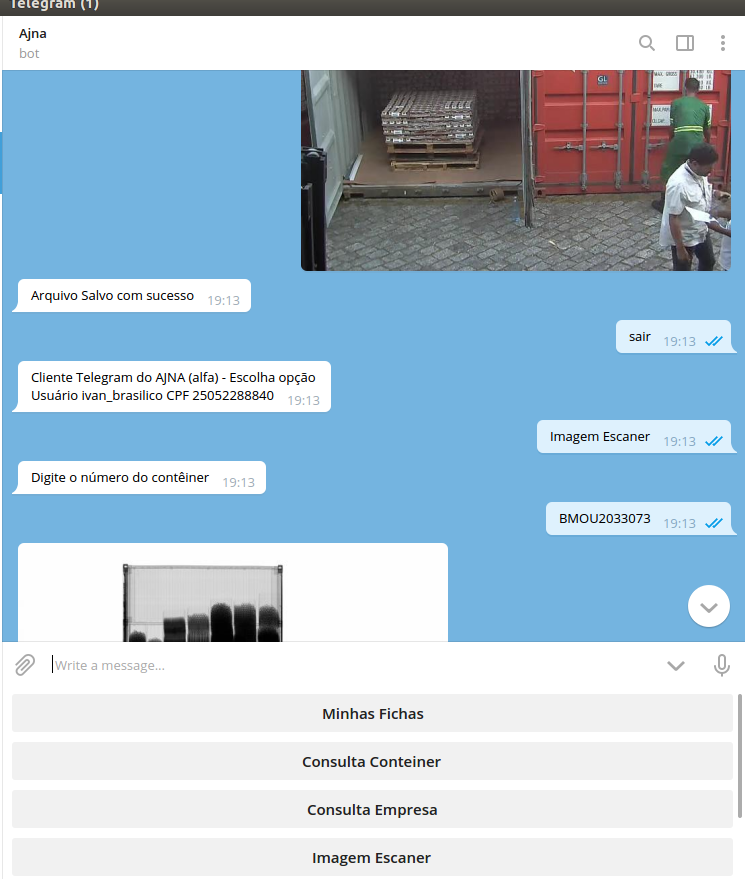

## Lançamento de opção de interface Telegram

Disponibilizado o bot [@Rfbajna_bot](https://t.me/Rfbajna_bot) no Telegram.

### Cadastramento

É preciso ter conta no Telegram, informar esta conta para cadastramento no 
banco de dados de Usuários do Sistema, e procurar o bot usando o Telegram   

### Funcionalidades

- Baixar imagem de escaneamento do contêiner

- Ver as "fichas a mim atribuídas", dentro destas, ver as RVFS

- Ver fotos anexadas nas fichas

- Modificar a descrição de uma RVF

- Fazer Upload de Fotos para uma RVF diretamente do celular

- Criar nova Ficha informando CE Mercante, e/ou DUE, e/ou Fiscalizado

- Criar nova RVF informando número do contêiner/lote

- Realizar as consultas de Contêiner e de Empresa disponíveis na interface web

