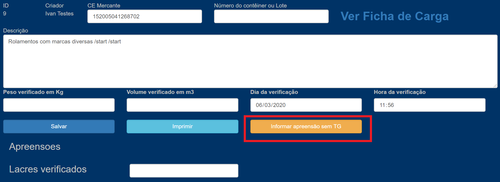
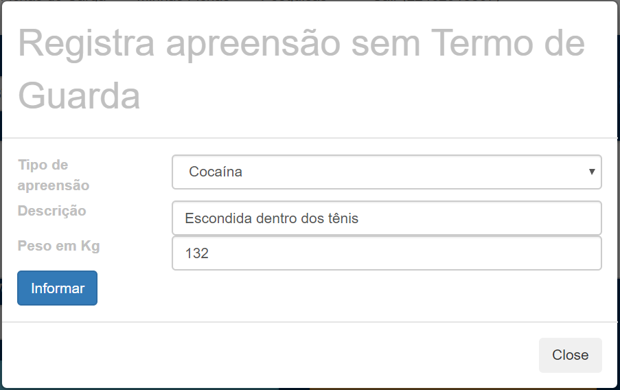
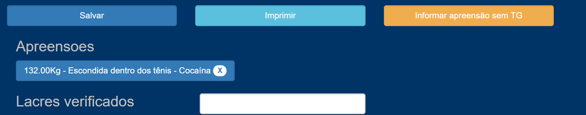
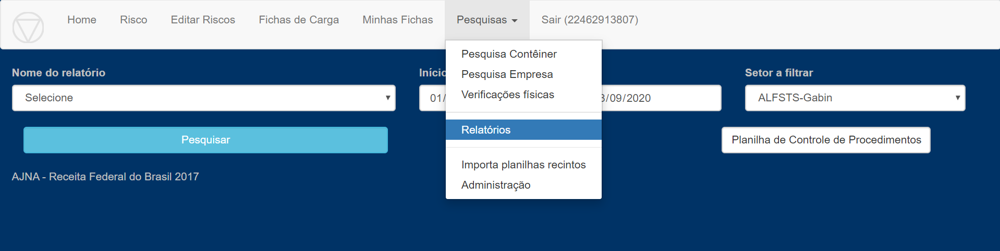
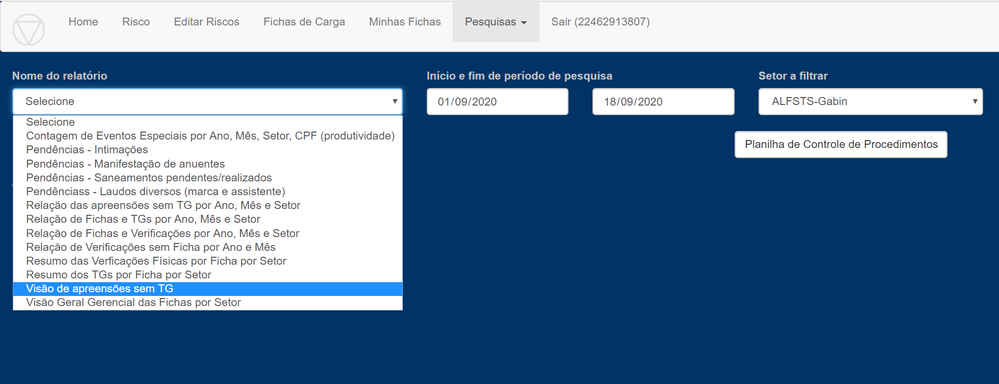
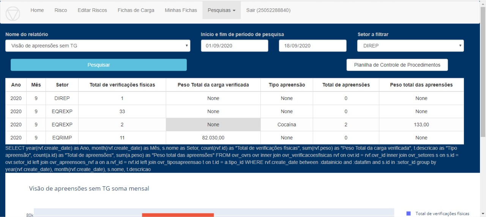

### Informar Apreensão sem TG

Ao cadastrar uma Verificação Física, agora é possível incluir as informações 
das apreensões efetuadas sem Termo de Guarda.  

Por enquanto está habilitado apenas apreensões de cocaína. Sendo possível incluir
 uma descrição da apreensão e o peso em Kg.
 
Além disso, as apreensões poderão ser acompanhadas em nível gerencial por meio
do relatório "Visão de apreensões sem TG".

#### Como usar 

* Na tela de Verificação Física, clicar no botão “Informar apreensão sem TG”:

* No pop-up que irá aparecer, é possível escolher o Tipo de Apreensão, fazer
 uma breve descrição e também informar o peso da apreensão.

* Por fim, a informação da Apreensão sem Termo de Guarda irá aparece na 
Verificação Física, sendo possível adicionar outras apreensões sem TG, 
bem como excluir alguma já informada.

#### Relatório "Visão de apreensões sem TG"
* As "Apreensões sem TG" poderão ser acompanhadas em nível gerencial 
por meio do relatório "Visão de apreensões sem TG", na aba "Pesquisa", 
item "Relatórios".

* Neste relatório é possível comparar o Total de Verificações Físicas 
com o Total de apreensões, Peso total da Carga, Tipo de apreensão 
e o peso total das apreensões, filtrados por Setor.
