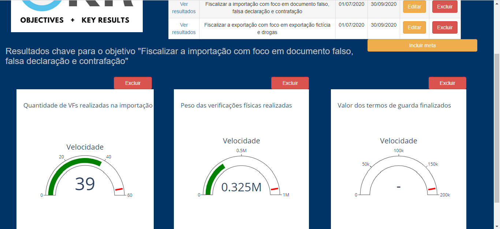
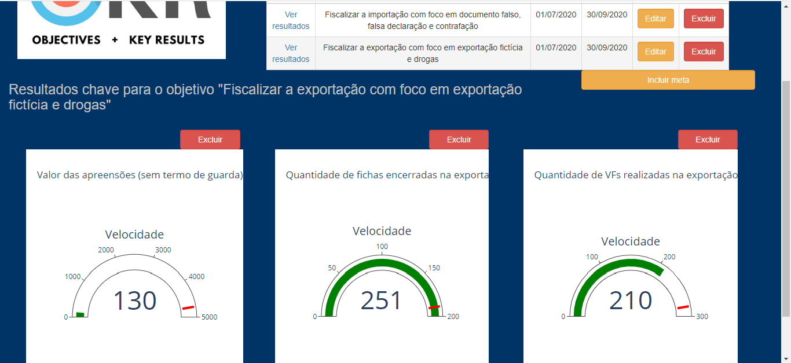

Foi intrudiza a funcionalidade "Painel de OKRs" no sistema. 

A inteção desse painel é definir Objetivos a serem mensurados, definindo-se 
os resultados que auxiliam nessa mensuração, bem como a meta esperada para
cada resultado.

Mais informações de como configurar é possível encontrar no item 
"Painel de OKRs" desse roteiro.

Exemplo de Painéis:

