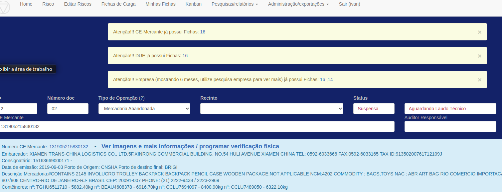

Foram introduzidos alertas de CE, DUE e CNPJ com Fichas ao cadastrar uma Ficha.

Esta ação se soma às "Pesquisas rápidas" por CE, DUE, Contêiner e Empresa, visando 
conseguir localizar rapidamente operações em andamento ou encerrados, evitando duplicidade de ações 
e integrando várias fontes de dados.
 
Exemplo de alertas:

