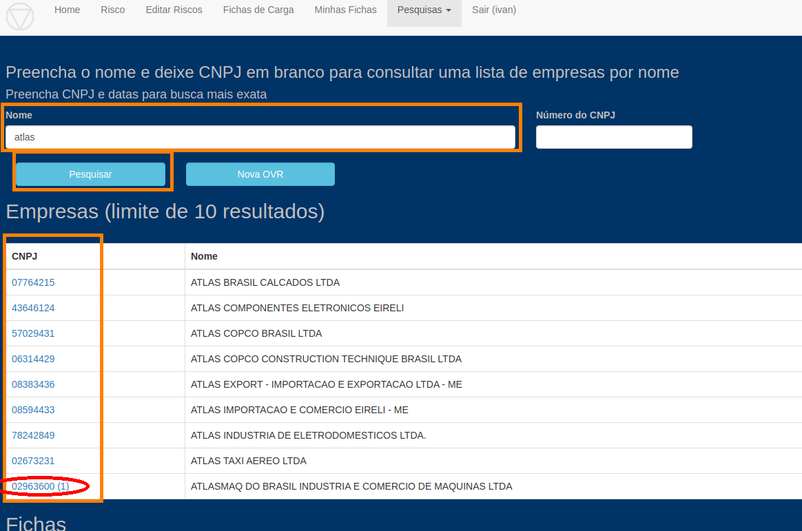
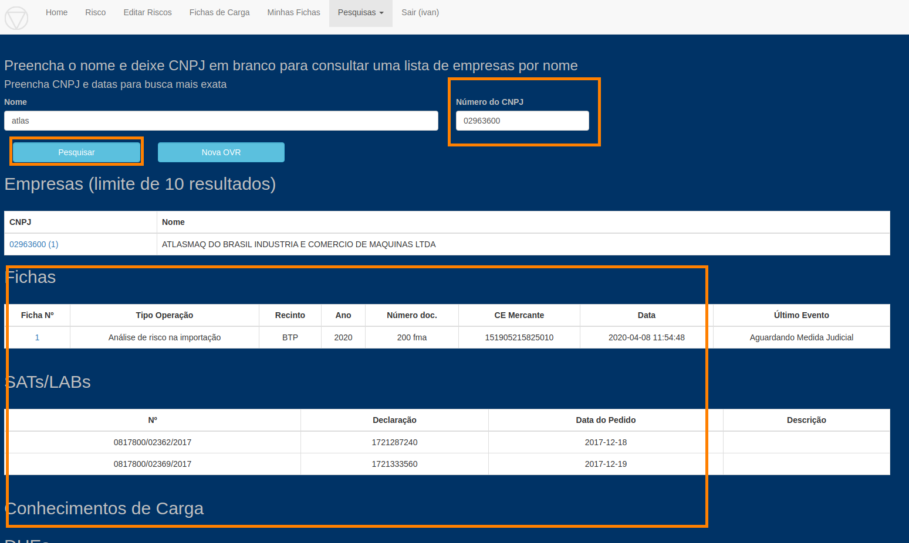

#### Tela Pesquisa Empresa

Nesta tela, a partir do nome da empresa, CNPJ ou parte deles, o sistema vai listar:

    Empresas com aquele nome ou CNPJ parcial
    Fichas para CE-Mercante ou DUE que tenha a empresa
    SATs/LABs solicitados para a Empresa
    CEs em que a empresa é consignatária.
    DUEs em que a empresa é exportadora

A Empresa "AtlasMaq do Brasil" possui uma Ficha. Ao pesquisar por "Atlas" aparece uma lista de empresas cujo 
nome começam com esta palavra. Apenas ao lado do CNPJ da "AtlasMaq" é exibido um (1) indicando que esta possui uma ficha.

Clicando no CNPJ da Empresa, ou digitando no campo CNPJ acima e clicando em Pesquisar, serão exibidas Fichas, SATs,
CEs-Mercante e DUEs desta Empresa, caso existam na base.

