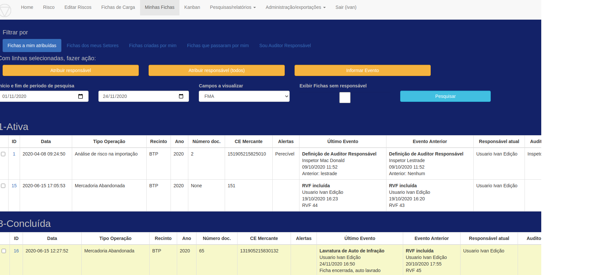
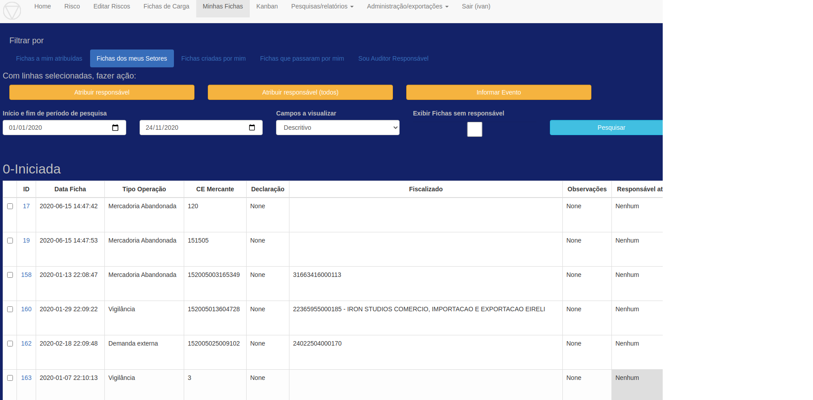
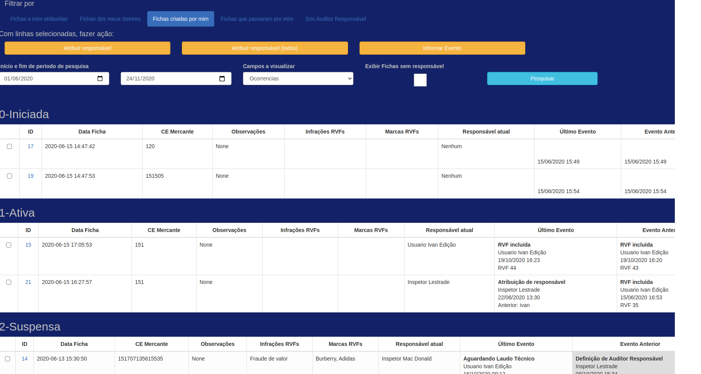
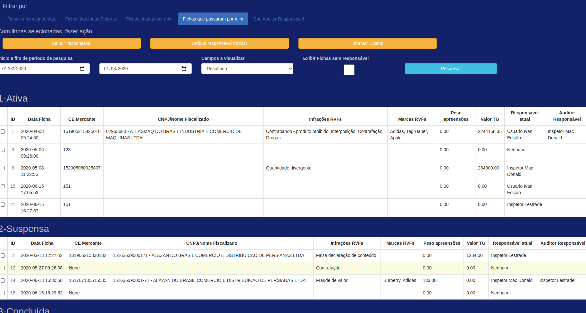
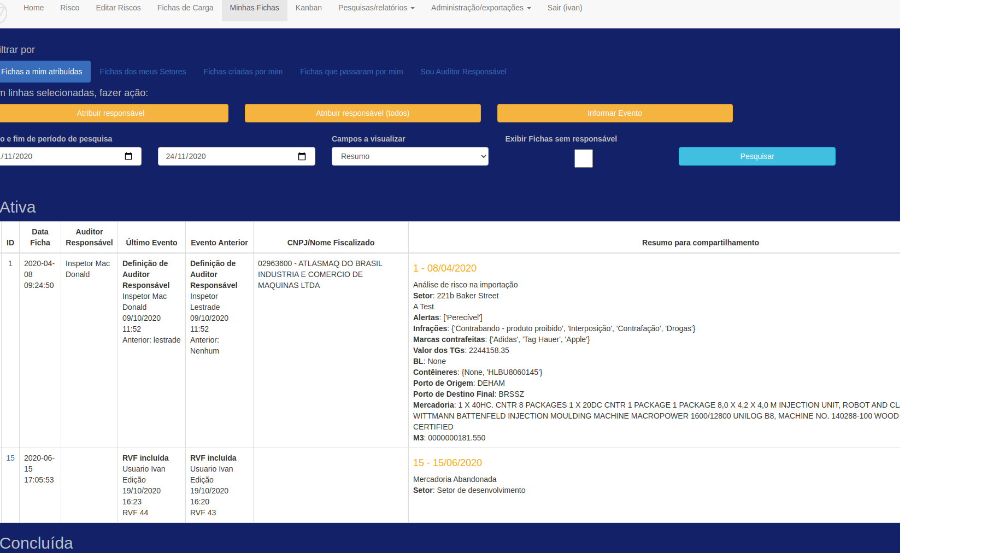

# Sistema AJNA

## Visão computacional aplicada - Aduana Brasileira

### Ficha de Controle de Carga - Minhas Fichas

Tela para localizar rapidamente Fichas de Operações, visualizar, abrir ou fazer ações em lote.

Opções:

* Fichas a mim atribuídas - fichas em que sou responsável e fichas órfãs se campo selecionado, não concluídas nem arquivadas
* Fichas dos meus Setores - todas as Fichas do meu Setor e filhos (filtra por datas)
* Fichas criadas por mim - todas as Fichas que eu cadastrei (filtra por datas)
* Fichas que passaram por mim - todas as Fichas que possuem Evento registrado por mim (filtra por datas)
* Sou Auditor Responsável - fichas em que sou Auditor responsável não concluídas nem arquivadas

Opções de visualização:

Para que numa pesquisa não seja necessário ficar abrindo Fichas para ver os detalhes, há diversas opções de
visualização no campo "Campos a visualizar". Experimente!!!

