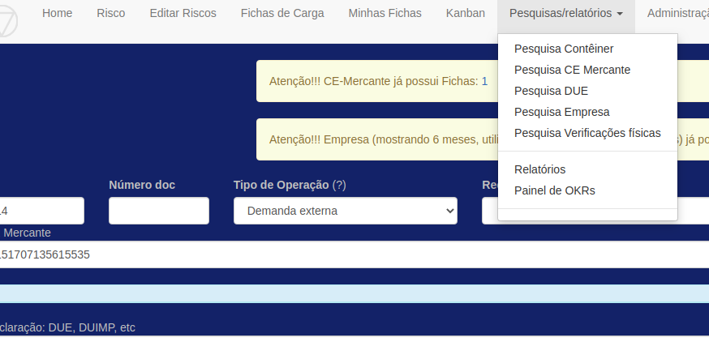

# Sistema AJNA

## Visão computacional aplicada - Aduana Brasileira

### Ficha de Controle de Carga - Pesquisas rápidas

Pesquisas acessíveis pelo menu "Pesquisas/relatorios". Exibem em uma única tela dados pesquisados em várias bases.

Opções de pesquisa:

[Número do contêiner](conteiner.md)

[Número do CE Mercante](ce.md)

[Número da Declaracao](due.md)  <-- no momento a DUE

[Nome ou CNPJ da Empresa](empresa.md)

